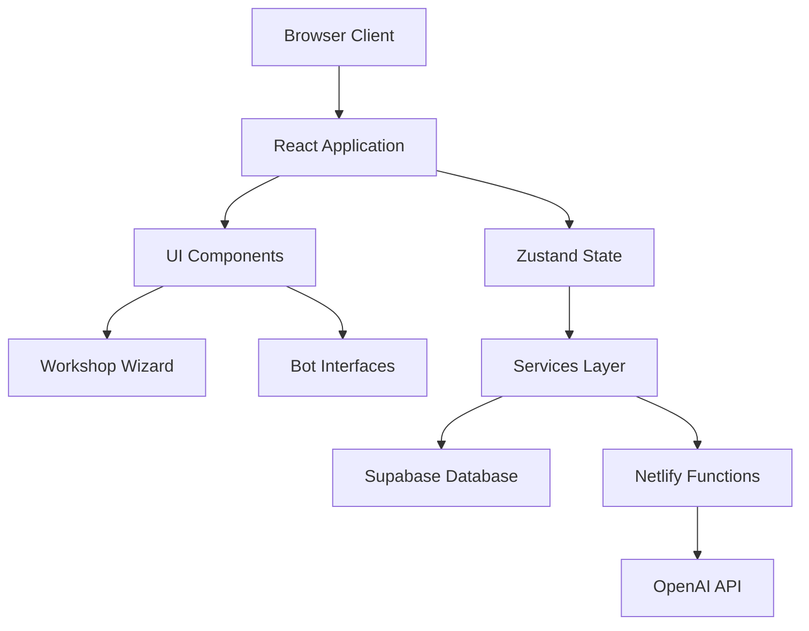

# Architecture Overview

## System Architecture



## Core Components

### Frontend Layer
1. **Workshop Wizard**
   - Manages step progression
   - Handles navigation
   - Controls step component rendering

2. **Step Components**
   - Individual workshop step implementations
   - Form handling
   - Data validation
   - Bot interaction triggers

3. **Bot Interfaces**
   - AI interaction components
   - Loading states
   - Response rendering
   - Error handling

### State Management
1. **Workshop Store**
   ```typescript
   interface WorkshopState {
     sessionId: string | null;
     currentStep: number;
     isSaving: boolean;
     workshopData: {
       antiGoals: AntiGoals;
       triggerEvents: TriggerEvent[];
       jobs: Job[];
       markets: Market[];
       problems: Problem[];
       selectedOffer: Offer;
     };
     botStates: {
       [key: string]: {
         isLoading: boolean;
         error: Error | null;
         response: any;
       };
     };
   }
   ```

2. **Actions**
   - Session management
   - Data persistence
   - Step navigation
   - Bot interactions

### Services Layer

1. **Database Service**
   ```typescript
   interface DatabaseService {
     saveWorkshopSession(sessionId: string, data: WorkshopData): Promise<void>;
     loadWorkshopSession(sessionId: string): Promise<WorkshopData>;
     updateWorkshopStep(sessionId: string, step: number): Promise<void>;
   }
   ```

2. **AI Service**
   ```typescript
   interface AIService {
     invokeTriggerBot(context: TriggerContext): Promise<BotResponse>;
     invokeJobBot(context: JobContext): Promise<BotResponse>;
     invokeMarketBot(context: MarketContext): Promise<BotResponse>;
     invokePainstormingBot(context: ProblemContext): Promise<BotResponse>;
     invokeOfferBot(context: OfferContext): Promise<BotResponse>;
   }
   ```

## Data Flow

### Session Initialization
1. Check local storage for existing sessionId
2. If none exists, generate new sessionId
3. Initialize workshop store
4. Load existing data if sessionId exists

### Data Persistence
1. User makes changes in step component
2. Component updates workshop store
3. Store triggers save action (debounced)
4. Database service saves to Supabase

### Bot Interaction
1. User triggers bot action
2. Store updates loading state
3. AI service calls Netlify Function
4. Function processes request and calls OpenAI
5. Response flows back through chain
6. Store updates with response
7. UI updates to show results

## Security Considerations

### Session Management
- Session IDs stored in local storage
- UUIDs used for session identification
- No sensitive data stored client-side

### API Security
- OpenAI key stored only in Netlify Functions
- Supabase RLS policies for data access
- CORS configuration on Netlify Functions

### Future Auth Integration
- Supabase Auth integration
- Protected routes implementation
- Session to user data migration
- RLS policy updates

## Performance Considerations

1. **State Management**
   - Selective component re-rendering
   - Debounced save operations
   - Optimistic UI updates

2. **Bot Interactions**
   - Loading states for better UX
   - Response caching where appropriate
   - Error retry mechanisms

3. **Data Loading**
   - Progressive data loading
   - Step prefetching
   - Response size optimization 